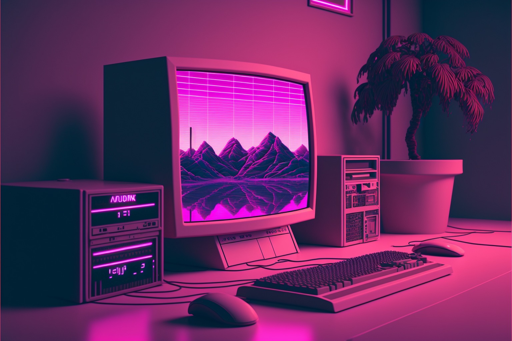

# Retos-Programacion

Este repositorio cuenta con una variedad de retos para practicar logica de programacion. Este repositorio esta basado en los retos de [Brais Moure](https://github.com/mouredev).
Los lenguajes utilizados son:

==Python== ==Lua== ==C++==

Pero te invito a que utilices otros lenguajes de tu preferencia.

## Listado de Retos
Los retos cuentan con archivo con el enunciado del reto, su resolucion y el codigo para cada reto.

  1. [EL FAMOSO "FIZZ BUZZ"]()

### Referencias

- [mouredev/Retos-Programacion-2023](https://github.com/mouredev/retos-programacion-2023)
- [mouredev/Weekly-Challenge-2022-Kotline](https://github.com/mouredev/Weekly-Challenge-2022-Kotlin)
- [exercim](https://exercism.org/)

**No olvides visitar los repositorios originales**

